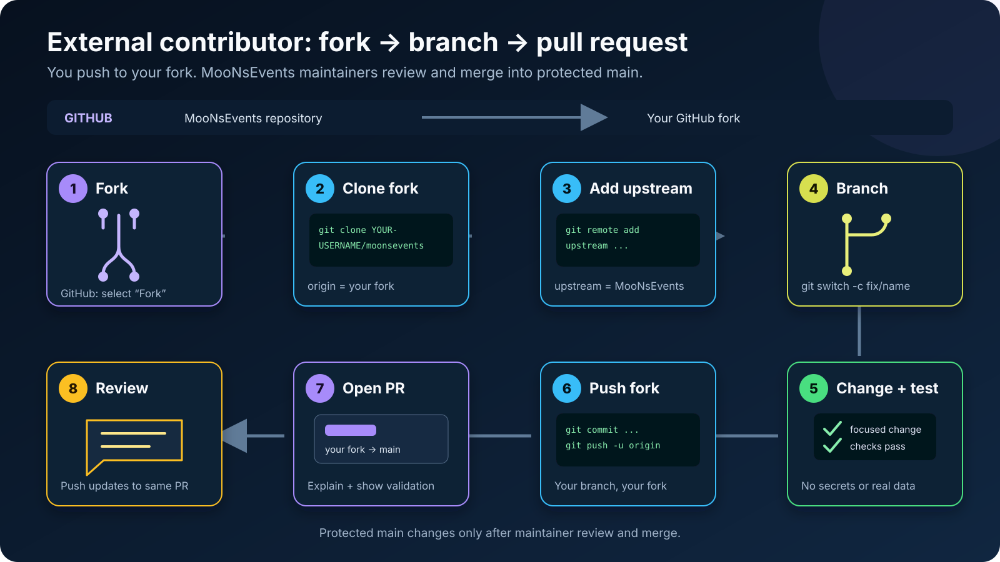

# Contributing to MooNsEvents

**[Overview](README.md)** · **[Features](docs/FEATURES.md)** ·
**[Setup](docs/GETTING_STARTED.md)** · **[Product showcase](docs/PRODUCT_TOUR.md)** ·
**[Support](SUPPORT.md)** · **[Code of Conduct](CODE_OF_CONDUCT.md)** ·
**[Security](SECURITY.md)** · **[MIT license](LICENSE)**

Thank you for helping improve MooNsEvents. Contributions are welcome across event operations, CRM,
inventory, CRM and operations, integrations, testing, accessibility, documentation, and developer
experience.

By participating, you agree to follow the [Code of Conduct](CODE_OF_CONDUCT.md). Project roles and
decision-making are documented in [GOVERNANCE.md](GOVERNANCE.md).

## Before you start

- Search existing issues and pull requests before opening a duplicate.
- Use an issue to discuss a large feature, schema change, or architectural change first.
- Keep pull requests focused. Separate unrelated cleanup from functional work.
- Never include customer data, production exports, recordings, credentials, `.env` files, or
  provider tokens.

## Local setup

Follow the [one-command Docker setup](docs/GETTING_STARTED.md#one-command-docker-start) or
[native development guide](docs/GETTING_STARTED.md#native-development).
If this is your first contribution, the
[visual setup and contribution guide](docs/VISUAL_SETUP_GUIDE.md) shows each Git and GitHub step.

For native development:

```bash
npm ci
npm run setup:env
npm run prisma:generate
npm run prisma:deploy:platform
npm run prisma:deploy
npm run prisma:seed --workspace @moonsevents/server
npm run dev:app
```

`npm run setup:env` refuses to overwrite an existing `.env`.

## Fork, branch, and commit workflow

External contributors do not need write access to `schowdary75/moonsevents`.



1. On GitHub, open the
   [MooNsEvents repository](https://github.com/schowdary75/moonsevents) and select **Fork**.
2. Clone your fork and enter the project:

   ```bash
   git clone https://github.com/YOUR-USERNAME/moonsevents.git
   cd moonsevents
   ```

3. Keep your fork as `origin` and add the public repository as `upstream`:

   ```bash
   git remote add upstream https://github.com/schowdary75/moonsevents.git
   git remote -v
   ```

Before each contribution, synchronize `main` and create a focused branch:

```bash
git switch main
git fetch upstream
git merge --ff-only upstream/main
git push origin main
git switch -c feat/short-description
```

Commit and push the branch to your fork:

```bash
git add path/to/changed-file
git commit -m "feat(area): describe the change"
git push -u origin feat/short-description
```

Use clear commit messages such as:

```text
feat(timelines): add schedule reorder controls
fix(vendors): preserve filters after an RFQ
docs(setup): clarify local MySQL grants
test(auth): cover refresh-token reuse
```

On GitHub, open a pull request with:

- base repository and branch: `schowdary75/moonsevents:main`
- head repository and branch: `YOUR-USERNAME/moonsevents:feat/short-description`

If review feedback requires changes, update the same local branch and push it again:

```bash
git switch feat/short-description
# Make and validate the requested changes.
git add path/to/changed-file
git commit -m "fix(area): address review feedback"
git push
```

The existing pull request updates automatically. Do not open a replacement pull request for each
review round.

Trusted collaborators with repository write access should still work on a feature branch and open
a pull request instead of pushing directly to protected `main`. See the
[collaborator visual workflow](docs/VISUAL_SETUP_GUIDE.md#trusted-collaborators-clone-the-main-repository).

## Contributor recognition

MooNsEvents recognizes community work across code, tests, documentation, design, accessibility,
issue research, and roadmap delivery. Recognition is based on accepted work, not the size of the
change or the contributor's prior experience.

- A first merged pull request earns the **First Timeline** badge.
- Three merged pull requests earn **Route Builder**.
- Five merged pull requests earn **Navigator**.
- Ten merged pull requests earn **Pathfinder**.
- A merged pull request that completes an issue attached to a project milestone earns
  **Roadmap Champion** recognition.
- Useful issue reports that are resolved and are not marked duplicate, invalid, or wontfix count
  toward the community leaderboard.

The [recognition program](docs/community/RECOGNITION.md) contains the complete scoring and
eligibility rules. The [Hall of Fame](docs/community/HALL_OF_FAME.md) highlights sustained or
milestone-defining work, and maintainers may issue a
[repository-verifiable certificate](docs/community/CERTIFICATES.md) for notable contributions.

Recognition does not require repository write access. If something was missed, open a
[recognition nomination](https://github.com/schowdary75/moonsevents/issues/new?template=recognition_nomination.yml)
with links to the relevant issues or pull requests.

## Code expectations

- Keep TypeScript types explicit at boundaries.
- Follow the API flow: routes, controllers, services, repositories, Prisma.
- Keep tenant data access inside the resolved tenant context.
- Make provider integrations report `unconfigured` or fail closed when credentials are absent.
- Do not perform external or commercial writes without the existing approval and audit controls.
- Preserve accessibility labels, keyboard behavior, loading states, and error states.
- Add or update tests when behavior changes.

## Database changes

- Change the correct Prisma schema: tenant or platform.
- Add a versioned migration; do not edit an already shared migration.
- Avoid destructive reset and schema-push commands against shared data.
- Update `docs/migration-manifest.md` when required by the migration workflow.
- Explain data backfills, rollout order, and rollback considerations in the pull request.

## Validate your change

Run the checks that match your change, and preferably the complete suite:

```bash
npm run secrets:check
npm run format:check
npm run lint
npm run typecheck
npm test
npm run build
```

If formatting fails, run `npm run format`, review the result, and rerun the checks.

## Pull requests

In the pull request:

- Explain the user or operator problem.
- Describe the solution and important tradeoffs.
- List the commands you ran.
- Include screenshots or a short recording for visible UI changes, using only synthetic data.
- Call out migrations, new environment variables, provider dependencies, and security impact.
- Link the related issue.

By contributing, you agree that your contribution may be distributed under the repository's
[MIT License](LICENSE).
