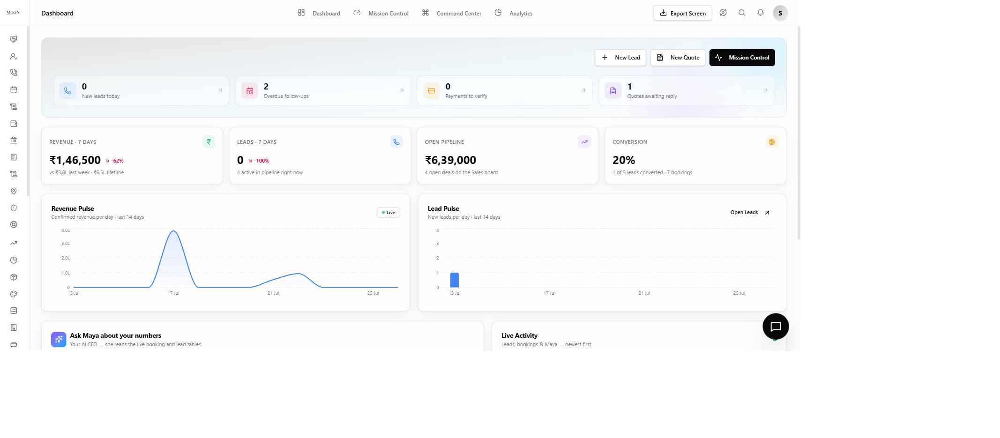
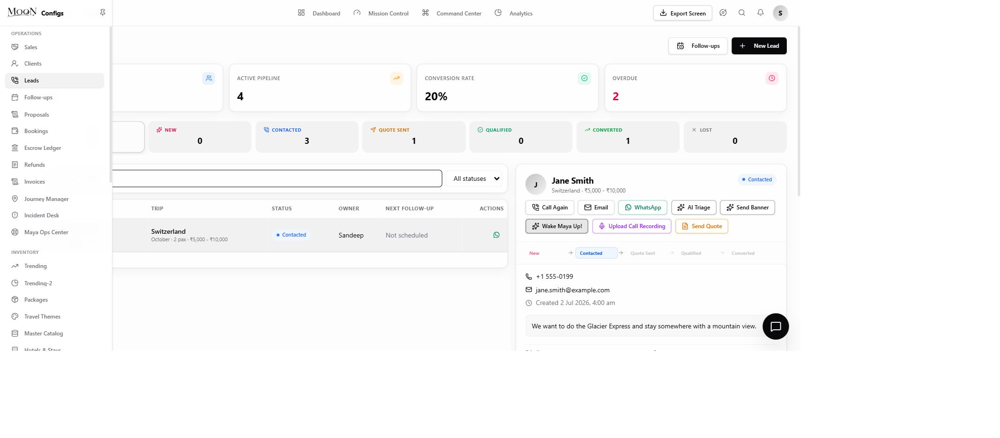
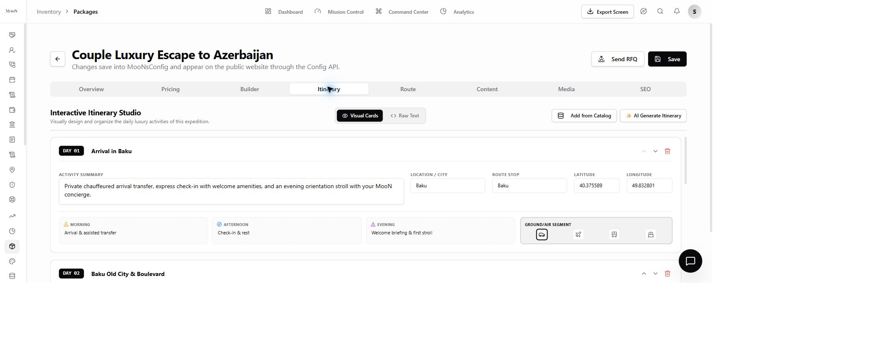
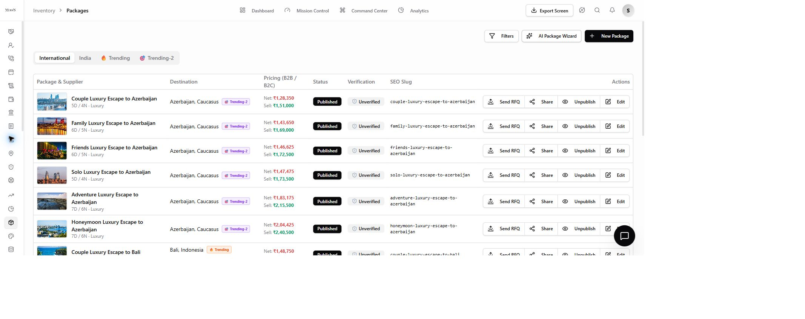
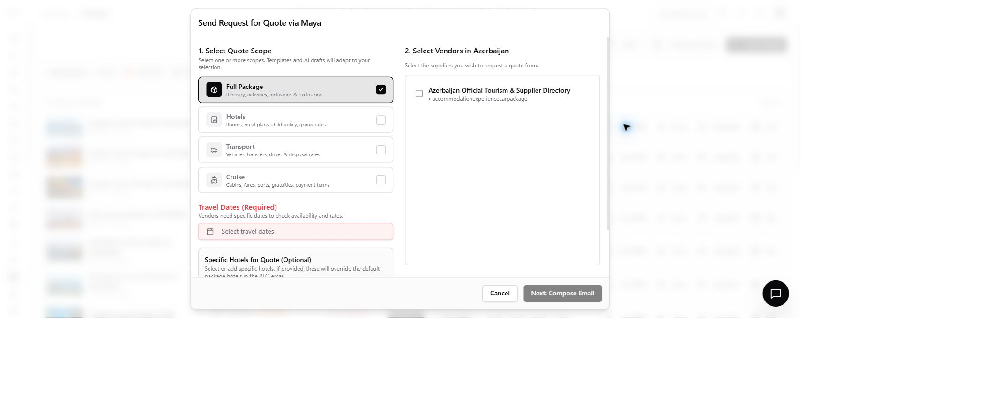
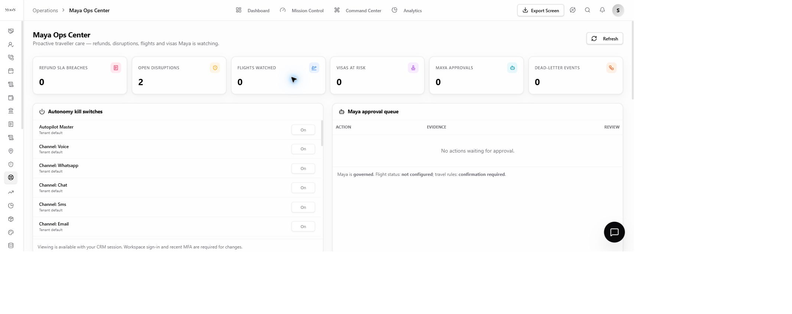

# MooNsEvents product showcase

This showcase uses direct Chrome captures from a locally running copy of MooNsEvents. The images are
not concept mock-ups and do not claim a customer deployment. The lead workspace is filtered to a
clearly fictional `Jane Smith` / `555` demo record so no real customer information is published.

## The workflow to evaluate

1. Capture an enquiry from a form, call, callback, chat, or WhatsApp.
2. Curate an editable runOfShow from the brief or an inspiration image.
3. Add catalogue activities, stays, rooms, cars, transfers, media, and route stops.
4. Select suppliers and compose an RFQ for the required dates and scope.
5. Build a versioned proposal from catalogue and rate-card data.
6. Move the accepted event into bookings, payments, documents, operations, and support.

## Dashboard

The dashboard surfaces leads, overdue work, quotes, pipeline, conversion, and revenue. Figures in
the screenshot belong to the local development database and are shown only to demonstrate the
interface.

## Lead workspace and WhatsApp entry point

Calls, email, WhatsApp, AI triage, notes, recordings, quotes, status, and follow-ups stay attached
to the lead. The two-way WhatsApp inbox becomes available only after a workspace administrator
configures its own Meta WhatsApp Business account.

## Run-of-Show studio

Teams can edit the title, summary, city, route stop, coordinates, morning, afternoon, evening, and
transport segment for every day. AI generation is a starting point, not an irreversible answer.

## Packages

The package workspace connects B2B cost, B2C selling price, margin, publishing state, verification,
SEO, media, runOfShow, route, supplier, and RFQ work.

## Supplier RFQs

Operators choose package, venue, transport, or venueProduction scope; provide events dates; select suppliers;
and review the composed message before dispatch.

## Maya operations and guardrails

Maya's channels, tools, approval queue, provider readiness, disruption cases, refund SLAs, and
dead-letter events stay visible to operators. Sensitive external actions can remain approval-bound,
and deployments have an external-write kill switch.

## What is intentionally not shown

- No credentials, access tokens, provider secrets, or environment files.
- No claim that an unconfigured provider-backed workflow is operational.
- No customer logos, testimonials, or usage metrics.
- No performance or scale number that has not been reproduced and documented.

For setup, see the [getting-started guide](GETTING_STARTED.md). For maturity and limitations, see
[project status](PROJECT_STATUS.md).
