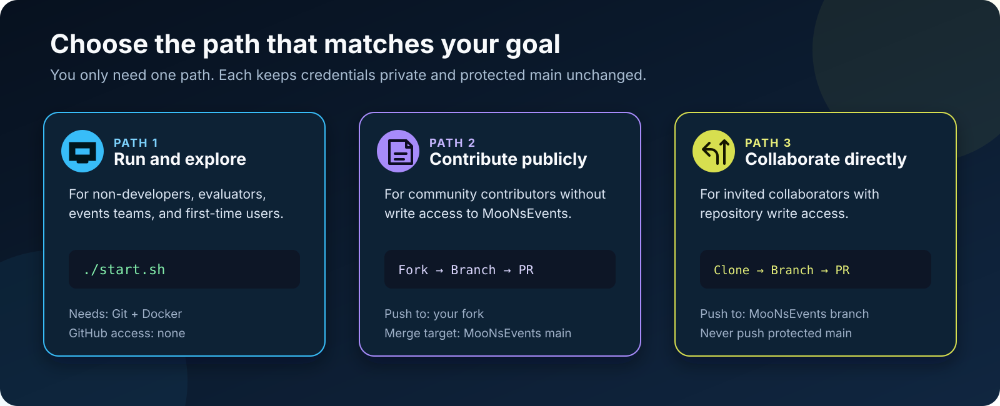
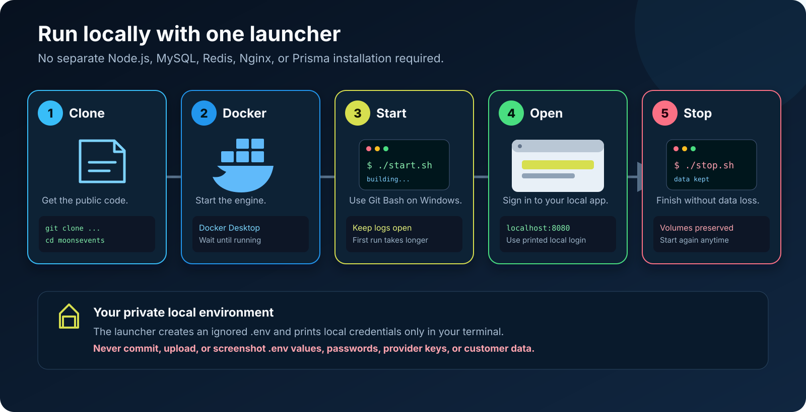
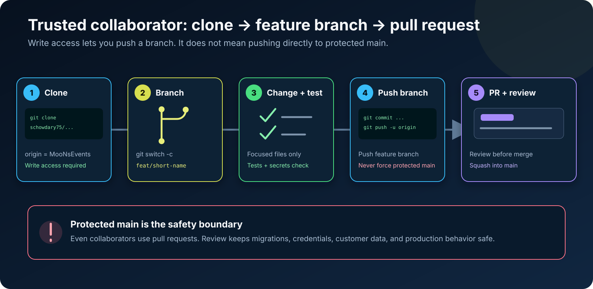
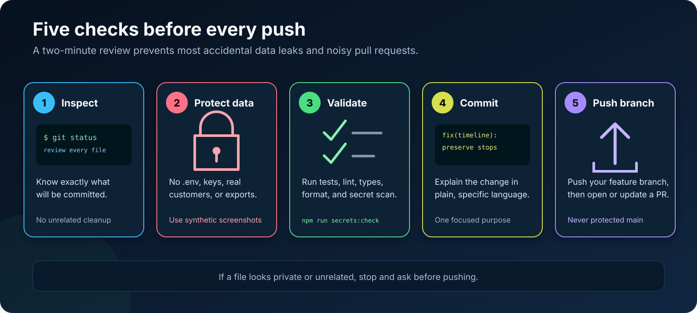

# Visual setup and contribution guide

This guide separates the three common MooNsEvents workflows. Pick the path that matches what you
want to do; you do not need to follow every section.



| Your goal                             | Use this path                                                               | GitHub write access required? |
| ------------------------------------- | --------------------------------------------------------------------------- | ----------------------------- |
| Run and explore MooNsEvents           | [One-command Docker start](#run-moonsevents-without-a-development-setup)    | No                            |
| Contribute from the community         | [Fork-first workflow](#external-contributors-fork-first)                    | No                            |
| Contribute as an invited collaborator | [Feature-branch workflow](#trusted-collaborators-clone-the-main-repository) | Yes                           |

## Run MooNsEvents without a development setup



You need only [Git](https://git-scm.com/) and
[Docker Desktop](https://www.docker.com/products/docker-desktop/) on Windows or macOS. Linux users
can use Docker Engine with the Docker Compose v2 plugin. Node.js, MySQL, Redis, Nginx, Prisma, and
project packages run inside containers.

### 1. Clone the public repository

```bash
git clone https://github.com/schowdary75/moonsevents.git
cd moonsevents
```

### 2. Start Docker

- **Windows/macOS:** open Docker Desktop and wait for the engine to report that it is running.
- **Linux:** ensure the Docker service is running and `docker compose version` succeeds.

### 3. Run the launcher

On Windows, open the repository in **Git Bash**. On Linux or macOS, use a terminal:

```bash
chmod +x start.sh stop.sh # Linux/macOS only; harmless if already executable
./start.sh
```

The first run builds the stack and can take several minutes. Keep the terminal open to see live
logs. When the launcher reports that the application is ready, open:

<http://localhost:8080>

The launcher prints the initial local login. That password belongs only to your ignored `.env`
file—never paste it into an issue, screenshot, commit, or pull request.

### 4. Stop without deleting data

```bash
./stop.sh
```

Running `./stop.sh` preserves Docker volumes, local databases, uploads, and Redis data. Run
`./start.sh` again to continue later.

### Quick troubleshooting

| What you see                   | What to check                                                           |
| ------------------------------ | ----------------------------------------------------------------------- |
| `docker: command not found`    | Install Docker Desktop or Docker Engine                                 |
| Docker daemon connection error | Start Docker Desktop or the Docker service                              |
| Windows says `.sh` is unknown  | Use Git Bash or WSL, not Command Prompt                                 |
| Port `8080` is already in use  | Stop the other local service or inspect it before changing ports        |
| A provider says `unconfigured` | Core features run locally; optional providers need your own credentials |

`./start.sh` already performs the required Docker checks. Developers who also
have Node.js and npm installed can optionally run the read-only Docker doctor
for a more detailed report:

```bash
npm run doctor -- --docker
```

## External contributors: fork first


A **fork** is your GitHub copy of MooNsEvents. A **clone** is the copy on your computer. External
contributors push to their fork and ask MooNsEvents to merge the change through a pull request.

### 1. Fork on GitHub

Open <https://github.com/schowdary75/moonsevents> and select **Fork**. GitHub creates:

```text
https://github.com/YOUR-USERNAME/moonsevents
```

### 2. Clone your fork

```bash
git clone https://github.com/YOUR-USERNAME/moonsevents.git
cd moonsevents
git remote add upstream https://github.com/schowdary75/moonsevents.git
git remote -v
```

`origin` should point to your fork. `upstream` should point to the public MooNsEvents repository.

### 3. Synchronize and create a branch

```bash
git switch main
git fetch upstream
git merge --ff-only upstream/main
git push origin main
git switch -c fix/short-description
```

Use a short branch such as `docs/setup-picture`, `fix/timeline-keyboard`, or
`test/vendor-adapter`.

### 4. Make and validate the change

```bash
npm run secrets:check
npm run format:check
npm run lint
npm run typecheck
npm test
```

Run the checks that match your change. Never add `.env`, credentials, database exports, customer
information, call recordings, or production screenshots.

### 5. Commit and push your branch

```bash
git status
git add path/to/changed-file
git commit -m "fix(area): explain the change"
git push -u origin fix/short-description
```

### 6. Open the pull request

On GitHub, select **Compare & pull request** and verify:

```text
base: schowdary75/moonsevents:main
head: YOUR-USERNAME/moonsevents:fix/short-description
```

Describe the problem, solution, validation commands, and screenshots for visible UI changes. If a
review requests changes, update the same branch:

```bash
git add path/to/updated-file
git commit -m "fix(area): address review feedback"
git push
```

The existing pull request updates automatically.

## Trusted collaborators: clone the main repository



Use this path only when a maintainer has granted your GitHub account write access.

```bash
git clone https://github.com/schowdary75/moonsevents.git
cd moonsevents
git switch -c feat/short-description

# Make and validate the focused change.
git status
git add path/to/changed-file
git commit -m "feat(area): explain the change"
git push -u origin feat/short-description
```

Open a pull request from `feat/short-description` into `main`. Do not push directly to protected
`main`, force-push shared branches, or mix unrelated changes in the same pull request.

## Before every push



1. Run `git status` and inspect every file.
2. Confirm that `.env`, credentials, customer data, exports, recordings, logs, and generated
   runtime files are absent.
3. Run `npm run secrets:check` plus the relevant tests.
4. Use a clear commit message that explains the change.
5. Push only your focused feature branch.

## What happens after the pull request

Maintainers review the code, validation evidence, security impact, and user experience. Update the
same branch when feedback arrives. When the pull request is ready, a maintainer squash-merges it
into protected `main`.

Accepted contributions appear in the [contributor leaderboard](community/LEADERBOARD.md) and can
earn [recognition badges, Roadmap Champion status, Hall of Fame entries, and digital
certificates](community/RECOGNITION.md).
